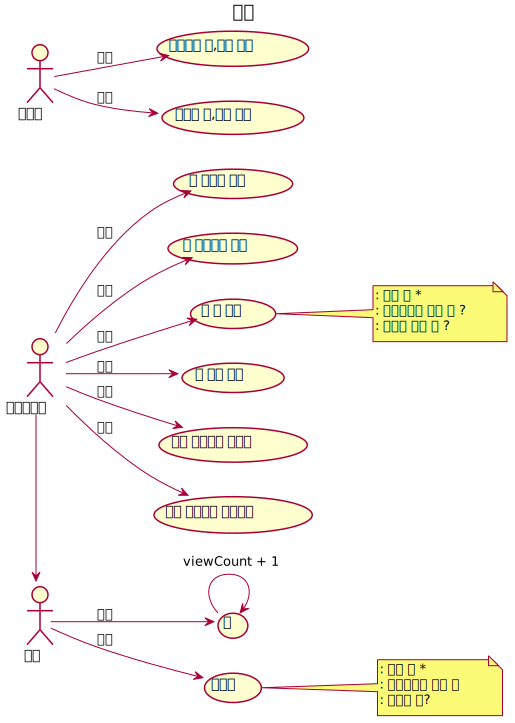
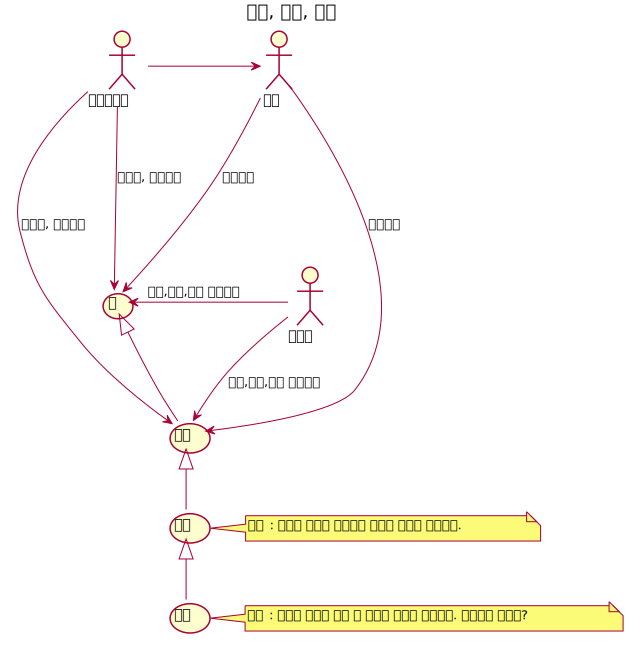
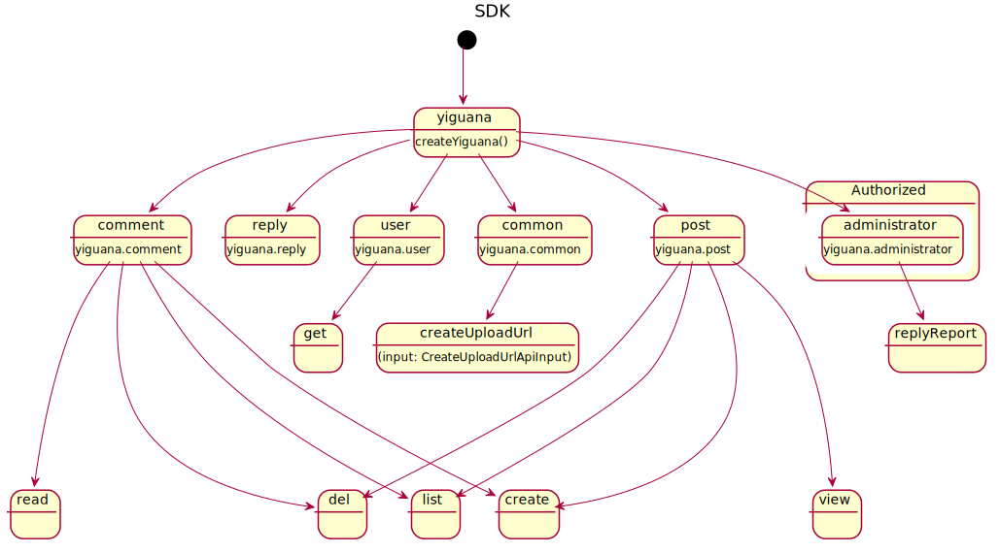
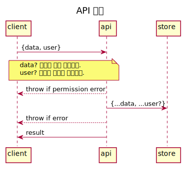
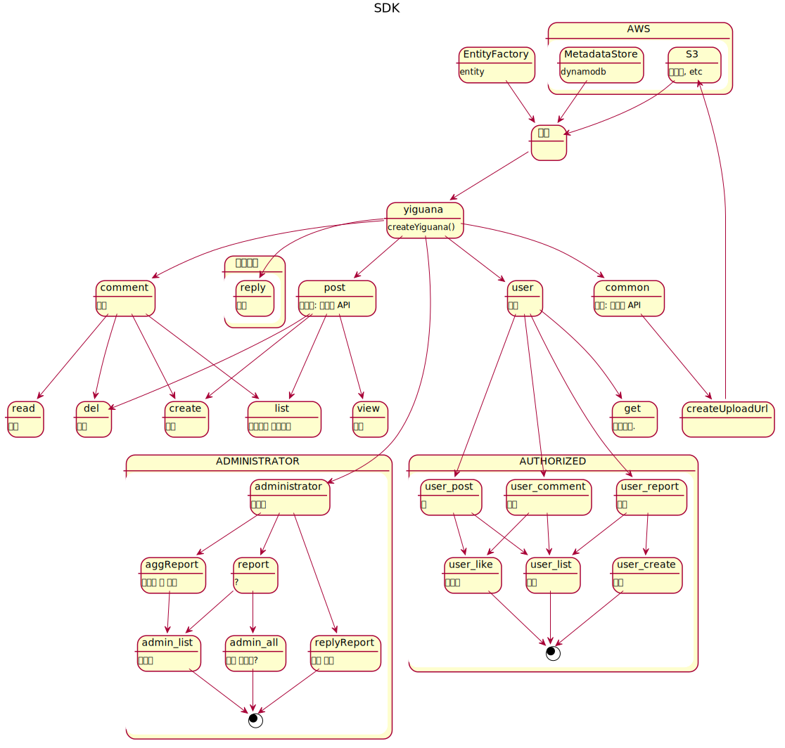

# @deptno/yiguana


yiguana-sdk,

## v2
- [ ] read, view, get 이 비슷한 의미를 가진다 통일 가능한지
  - Comment.read
  - User.get
  - Post.view
  
## gsi
- byUser: 유저별로 데이터를 가져온다.
- posts: 포스트 목록을 시간순으로 가져온다.
- postsByCategory: 포스트 목록을 카테고리별로 가져온다.
- comments: 특정 포스트에 대한 댓글 목록을 가져온다.
- reports: 신고된 리스트를 가져온다.(? 기억이 가)
- reports: 신고 종료된 리스트를 가져온다.(? 기억이 가물)물
- postsByChildrenUpdatedAt: `rk` + `childrenUpdatedAt` 최근 댓글이 달린 순으로 포스트 목록을 가져온다.
  
## uml
### 유스케이스
#### 보기

#### 생성,수정,삭제</summary>

### 클래스 다이어그램

### 시퀀스 다이어그램


---

### Yiguana SDK V0 흐름도


## log
```shell script
DEBUG=yiguana
DEBUG=yiguana:assert
DEBUG=yiguana:api:common
DEBUG=yiguana:api:post
DEBUG=yiguana:api:comment
DEBUG=yiguana:api:reply
DEBUG=yiguana:api:administrator:report
DEBUG=yiguana:api:administrator:aggReport
DEBUG=yiguana:api:user
DEBUG=yiguana:api:user:post
DEBUG=yiguana:api:user:comment
DEBUG=yiguana:api:user:reply
DEBUG=yiguana:api:user:report
DEBUG=yiguana:store:s3
DEBUG=yiguana:store:ddb
```

## changelog
- 0.4.0 postsByChildrenUpdatedAt: `rk` + `childrenUpdatedAt` 최근 댓글이 달린 순으로 포스트 목록을 가져온다.
- 0.4.0 포스트가 없는 댓글을 달때 집계 객체를 생성할 수 있는 API 생성(comment.createAndCreatePostIfNotExits)
- 0.4.1 post.list({childrenUpdatedAt: true})
- 0.4.2 api 인자 오타 수정
- 0.4.2 comment.createAnd... 호출시 latestComment 를 Post 에 남기도록 함
