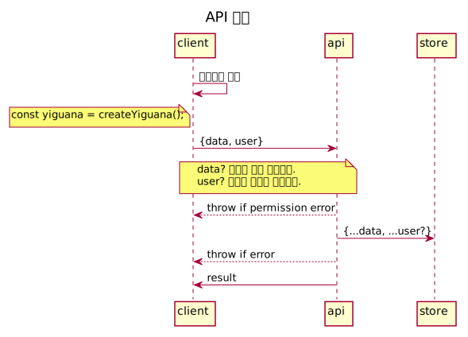

# @deptno/yiguana


yiguana-sdk,

## v2
- [ ] read, view, get 이 비슷한 의미를 가진다 통일 가능한지
  - Comment.read
  - User.get
  - Post.view
## uml

<details>
    <summary>유스케이스 - 보기</summary>
    
</details>
<details>
    <summary>유스케이스 - 생성,수정,삭제</summary>
    
</details>
<details>
    <summary>클래스 다이어그램</summary>
    
</details>
<details>
    <summary>시퀀스 다이어그램</summary>
    
</details>
<details>
    <summary>시퀀스 다이어그램</summary>
    
</details>
<details>
    <summary>API 접근 다이어그램</summary>
    
</details>


## log
```shell script
DEBUG=yiguana
DEBUG=yiguana:assert
DEBUG=yiguana:api:common
DEBUG=yiguana:api:post
DEBUG=yiguana:api:comment
DEBUG=yiguana:api:reply
DEBUG=yiguana:api:administrator:report
DEBUG=yiguana:api:administrator:aggReport
DEBUG=yiguana:api:user
DEBUG=yiguana:api:user:post
DEBUG=yiguana:api:user:comment
DEBUG=yiguana:api:user:reply
DEBUG=yiguana:api:user:report
DEBUG=yiguana:store:s3
DEBUG=yiguana:store:ddb
```
